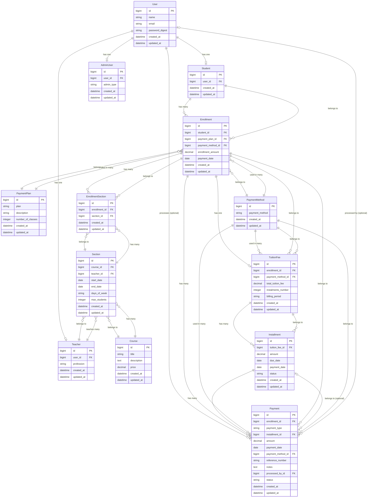

# Diagrama de Base de Datos - Academy Management System

## Diagrama de Relaciones (ER Diagram)



## Descripción de Modelos

### 👤 Usuarios y Roles
- **User**: Usuario base del sistema
- **Student**: Estudiante (hereda de User)
- **Teacher**: Profesor (hereda de User)
- **AdminUser**: Administrador (hereda de User)

### 📚 Académico
- **Course**: Cursos disponibles
- **Section**: Secciones/horarios de cursos (impartidas por un profesor)

### 📝 Inscripciones
- **Enrollment**: Inscripción de un estudiante
- **EnrollmentSection**: Tabla intermedia (muchos a muchos entre Enrollment y Section)

### 💰 Pagos y Cuotas
- **PaymentPlan**: Planes de pago disponibles
- **PaymentMethod**: Métodos de pago (efectivo, transferencia, etc.)
- **TuitionFee**: Arancel asociado a una inscripción
- **Installment**: Cuotas mensuales del arancel
- **Payment**: Registro de pagos (matrícula y cuotas)

## Relaciones Clave

### Inscripción Multi-Sección
Un estudiante puede inscribirse en múltiples secciones a través de una sola inscripción:
```
Student → Enrollment → EnrollmentSection ← Section
```

### Sistema de Pagos
Los pagos están centralizados en la tabla `Payment`:
- **Pago de Matrícula**: `payment_type = 'enrollment_fee'` (installment_id = NULL)
- **Pago de Cuota**: `payment_type = 'installment'` (con installment_id)

### Cuotas y Aranceles
```
Enrollment → TuitionFee → Installment ← Payment
```

## Notas de Diseño

1. **Separación de Conceptos**:
   - `Enrollment.enrollment_amount`: Monto de matrícula
   - `TuitionFee.total_tuition_fee`: Monto total del arancel (dividido en cuotas)

2. **Pagos Parciales**:
   - Una cuota (`Installment`) puede tener múltiples pagos (`Payment`)
   - Se calcula el total pagado sumando todos los payments asociados

3. **Auditoría**:
   - `Payment.processed_by_id`: Usuario que registró el pago
   - `Payment.reference_number`: Número de transacción bancaria
   - `Payment.notes`: Notas adicionales

4. **Estados**:
   - `Payment.status`: completed, pending, refunded
   - `Installment.status`: pending, paid, overdue (se actualiza automáticamente)
